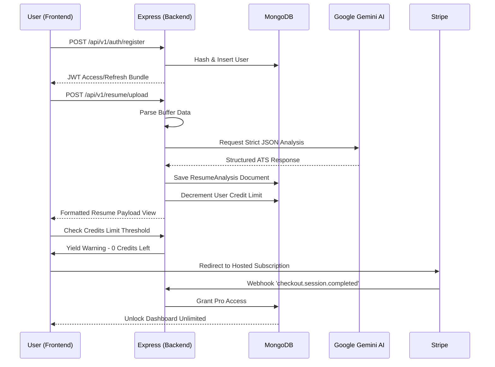

# CareerPilot AI - Comprehensive Architectural Documentation

This document serves as the exhaustive, deep-dive reference architecture for **CareerPilot AI**. It covers component trees, exact data pipelines, artificial intelligence implementation techniques, system schemas, and business logic execution.

---

## 1. System Paradigm & Core Technologies

CareerPilot AI is an enterprise-scale application structured with a decoupled client-server pattern. 
- **Client (Frontend)**: Next.js 14 App Router, heavily optimized for Client-Side Rendering (CSR) of interactive tools with React Server Components (RSC) used for layout routing. 
- **Server (Backend)**: Node.js/Express.js, functioning as a stateless RESTful API, adhering to MVC principles with rigid controller-service separation.
- **Database**: MongoDB (via Mongoose), optimized for highly nested unstructured JSON objects generated by the AI pipelines.

### 1.1 Technology Stack Checklist
*   **Operating Language**: TypeScript (Strict mode enabled across both environments)
*   **Frontend UI Framework**: Next.js 14 (React 18)
*   **Design System & Styling**: Tailwind CSS (Utility-first), Framer Motion (Orchestrating micro-animations), Lucide-React (Iconography), and `clsx/tailwind-merge` (`cn` utility) for dynamic class collision resolution.
*   **State Management**: Zustand (Global Auth & Metadata state, synced to `localStorage`), React `useState/useEffect` (Local UI state).
*   **Network Transport**: Axios instances equipped with generic request/response interceptors to catch 401s uniquely for JWT rotation.
*   **Backend Framework**: Node.js natively wrapper by Express.js.
*   **Core NLP/AI Brain**: Google Gemini SDK (`@google/genai`) configured for deterministic parsing (JSON schema injections).
*   **Blob Storage**: Firebase Admin SDK orchestrating Google Cloud Storage Buckets (File persistence for PDF/DOCX resumes).
*   **Transaction Processing**: Stripe API (Subscriptions, Checkout Webhooks, Billing Limits).

---

## 2. Directory Matrix

### 2.1 Frontend Route Hierarchy (`app/`)
The Next.js App Router defines the global capability topology of the application:
*   `/(auth)/*`: Unauthenticated layouts grouping `/login` and `/register`. Uses `authStore.ts` middleware to repel signed-in users.
*   `/dashboard`: The main hub. Aggregates metrics via `<CreditWidget/>`, displays recently scanned Resumes, and active Roadmaps via independent skeleton-loaded modular cards.
*   `/resume`: Dedicated space for ATS execution. Embeds Firebase dropzones.
*   `/interview`: Chat-centric arena. Renders conversational AI text streams into readable blocks, grading interactions at every user submission.
*   `/linkedin`: Takes raw text structures (Headlines, summaries) and renders dynamic scorecards highlighting optimal terminology.
*   `/jobs`: Provides text-area inputs or paste-events for JDs against localized `User` cache to determine hiring probabilities.
*   `/roadmap`: Uses nested graphs/timelines built via pure CSS to orchestrate timeline goals.
*   `/settings`: Extensive user-control area with sub-vertical tabs (Profile, Notifications, Security, Billing).
*   `/pricing` & `/payment`: Public and protected pricing tiers, intercepting Stripe transaction parameters on `/payment/success` to update UI dynamically.
*   `/ads`: Dedicated ad-viewer ecosystem built natively for free-token generation.

### 2.2 Backend Service Architecture (`src/services/`)
The heavy lifting is decoupled from the Controllers to maintain unit testability.
*   `geminiService.ts`: Central AI orchestrator. Defines system instructions (system prompts), governs prompt temperature (set low for deterministic responses, e.g., 0.2), and handles fallback logic if Google API limits are reached.
*   `resumeService.ts`: Parses binary PDF data using `pdf-parse`, pushes blobs to Firebase `uploadFileToFirebase`, feeds resulting raw text strings into `geminiService` tied to a specific ATS instruction set, maps the JSON return into `ResumeAnalysis` collections.
*   `interviewService.ts`: Maps stateful conversations. Appends user answers physically into an `InterviewSession.questions` array, triggers `geminiService` to score just that array index, returning a 0-10 score and semantic feedback, triggering the next question visually.
*   `subscriptionService.ts`: Binds deeply to Stripe. Contains logic for Mock Upgrades (simulated environments), checks Feature access (Is user allowed to parse a resume? Returns True/False dependent on tokens), and dictates lifecycle cancellation vectors.
*   `groqService.ts`: Extended optional high-speed inferencing integrations targeting specialized workloads (e.g., LLaMA endpoints for Voice or instantaneous reasoning).

---

## 3. The Artificial Intelligence Engine (Pipeline Breakdown)

CareerPilot AI avoids simple chatbot interactions. Deeply structured, "Agentic" workflows are executed:

### 3.1 Unstructured Data to Structured Inference
For a User uploading a Resume:
1. Express intercepts `multipart/form-data` using `multer.memoryStorage()`.
2. Raw buffers are parsed using internal utilities to strip stylistic breaks, leaving pure strings.
3. Node triggers Gemini with the string and a **Strict Formatting Object Constraint**. This ensures Gemini does NOT reply with markdown or prose, but rather `{ "score": 85, "weaknesses": ["Kubernetes", "AWS"] }`.
4. Express parses the `.json()` safety wrapper directly into the Mongoose ODM `.create()` method. 

### 3.2 Iterative Interview State Machine
A mock interview relies on a state machine concept to maintain the illusion of active presence.
1. **Init Point**: The system requests 3 (Free) or unlimited (Pro) questions pre-generated to match the Role.
2. **Ping-Pong Loop**: The Frontend renders Question 1. User replies. Payload sent via `POST /interview/:id/answer`. Backend grades the answer immediately to maintain flow, saves to `MongoDB`, and responds explicitly with feedback *and the trigger signal* for Question 2.
3. **Termination Calculation**: Upon answering the final array index, the AI parses ALL answers synergistically into a `OverallInterviewFeedback` model, evaluating cohesive traits like 'Problem Solving' or 'Communication Skills'.

---

## 4. Ad-Supported Monetization & Tokenomics 

A cornerstone of CareerPilot AI is a zero-friction monetization funnel built for infinite global scalability. 

### 4.1 Token Metric Calculations ("CreditWidget")
- Access levels natively vary. Instead of hardcoding permissions, `subscriptionService.checkFeatureAccess(userId, featureName)` calculates remaining availability `MonthlyLimit (Constant) - Used (Counter) + AdCredits (Counter)`.
- If the return is `< 0`, standard UI hooks invoke `<CreditGateModal/>`, intercepting standard navigation events and explicitly preventing API spam.

### 4.2 The /ads Engine
To generate Ad credits without third-party junk, the system relies on high-quality mock-SaaS commercials:
- **Timer Execution**: Controlled strictly by React hooks. Timers run exclusively while the window is focused (preventing tab-abandonment exploitation). 
- **Backing Validation**: Endpoints deliberately delay responses if they detect ad execution endpoints hitting faster than the physics of 15 seconds.
- **Conversion Equation**: Every `2` ads atomic-updates the `User.usage.adCredits` field natively in MongoDB (`$inc`).

---

## 5. Security & Persistence Execution

### 5.1 JSON Web Token (JWT) Protocol
- **Access Tokens** (`15m`): Injected locally into Axio's Bearer Header variable dynamically by Zustand.
- **Refresh Tokens** (`7d`): Stored typically as cookies or heavy local storage. The `authApi.ts` client utilizes an interceptor that triggers `authApi.refreshToken()` implicitly if ANY API request yields `HTTP 401 Unauthorized`. This rotates the token and replays the original failed request instantly, creating an invisible, highly secure continuous session for the user experience.

### 5.2 Password Hygiene & Bcrypt
- Raw passwords *never* touch the log variables.
- Bcrypt salts variables `10` times natively within a Mongoose Pre-Save hook `UserSchema.pre('save', async function(next) { ... })` guaranteeing that even immediate Controller modifications auto-hash before Disk IO limits.

---

## 6. CSS & Visual Logic Framework 

The UI strives for immediate emotional impact utilizing "Glassmorphism" paradigms mapping ultra-modern software.

- **Foundational Color Math**: Pure hex `#000000` combined with `radial-gradient(circle at 50% 0%, rgba(99,102,241,0.1) 0%, transparent 70%)` creates deep, glowing atmospheric lighting standard without the cost of heavy image backgrounds.
- **Framer Motion Variants**: Common structures include `item = { hidden: { y: 20, opacity: 0 }, show: { y: 0, opacity: 1 } }`. Every dashboard card staggers entry linearly upon load to generate fluidity.
- **Tailwind Extension**: `tailwind.config.ts` incorporates rigorous CSS variable arrays configured specifically on `:root` CSS selectors to permit absolute structural control of dynamic "Dark Mode" mapping for identical contrast ratios mathematically mapped for accessibility standards.

---

## 7. Operational Workflow Chart

## Conclusion

CareerPilot AI represents highly advanced orchestrations of relational object interactions decoupled from complex heavy server loads. By delegating interface behaviors to the Client, computational ML processing to GCP API endpoints, and File persistence caching to remote CDNs, the core Express architecture stays inherently lightweight, stable, scalable, and relentlessly focused on transactional data validations and secure user experiences.